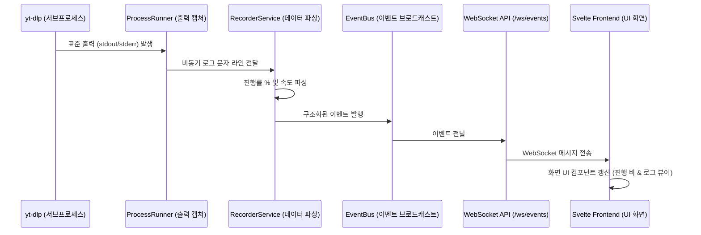

# 애플리케이션 아키텍처 가이드

`yt-dlp-webui`는 Windows 환경에 최적화된 독립형 트레이 애플리케이션입니다. 시스템은 크게 세 가지 주요 레이어(Desktop Launcher, FastAPI Backend, Svelte Frontend)로 구성되어 있습니다.

---

## 1. 3계층 레이어 구조 (Three-Layer Architecture)

```mermaid
graph TD
    Launcher[1. Desktop Launcher (트레이 및 브라우저 제어)] <--> Backend[2. FastAPI Backend (비즈니스 로직 & API)]
    Backend <--> Frontend[3. Svelte Frontend (사용자 UI)]
    Backend --> Subprocess[yt-dlp / FFmpeg / Deno 실행]
```

### 1) 데스크톱 런처 (Desktop Launcher)
- **주요 역할:** 애플리케이션의 진입점(Entry Point) 및 윈도우 시스템 트레이 메뉴 관리.
- **주요 기능:**
  - 백그라운드에서 FastAPI 웹 서버(Uvicorn) 프로세스를 안전하게 기동합니다.
  - 사용자가 앱을 실행하면 시스템 기본 웹 브라우저를 열어 웹 UI 대시보드로 자동 연결합니다.
  - 윈도우 작업 표시줄 트레이 아이콘을 통해 대시보드 열기, 라이브 모니터링 즉시 시작, 전체 작업 정지, 애플리케이션 종료 등의 간편 메뉴를 제공합니다.

### 2) FastAPI 백엔드 (FastAPI Backend)
- **주요 역할:** 시스템의 핵심 비즈니스 로직 처리, 다운로드 제어 및 파일 브라우징 API 서비스 제공.
- **주요 기능:**
  - **설정 관리:** TOML 설정 파일(`settings.toml`) 및 SQLite 데이터베이스(`webui.db`)를 기반으로 사용자 설정을 파싱하고 저장합니다.
  - **작업 관리:** 서브프로세스(Subprocess)를 활용하여 `yt-dlp`, `FFmpeg` 등 외부 바이너리 도구를 안전하게 조작합니다.
  - **도구 관리:** 필요한 외부 실행 도구들이 로컬 환경에 알맞게 다운로드되어 있는지 검사하고 필요시 자동 설치를 유도합니다.
  - **실시간 통신:** WebSocket 연결을 통해 다운로드 진행률 및 작업 실시간 로그를 프론트엔드로 브로드캐스트합니다.

### 3) Svelte 프론트엔드 (Svelte Frontend)
- **주요 역할:** 사용자에게 시각적인 다운로드 및 녹화 제어 화면 제공.
- **주요 기능:**
  - 실시간 녹화 중인 채널 목록, 작업 진행률 바, 실시간 로그 콘솔을 렌더링합니다.
  - 다양한 UI 테마 스위처를 지원하며 데이지 UI(DaisyUI) 기반의 직관적인 반응형 디자인 레이아웃을 갖추고 있습니다.

---

## 2. 데이터 저장소 및 경로 규격

데이터의 성격에 따라 격리된 경로를 사용하여 시스템 안정성을 극대화합니다.

* **가변 설정 및 캐시 데이터 (`%APPDATA%\yt-dlp-webui`):**
  - 설정값(`settings.toml`), 라이브 채널 DB(`webui.db`), 도구 바이너리 폴더(`tools/`), 작업 진행 아카이브 목록(`archive.txt`), 백엔드 로그(`logs/`) 등이 위치하는 앱의 런타임 데이터 저장소입니다.
* **대용량 미디어 파일 (`%USERPROFILE%\Videos\yt-dlp-webui`):**
  - 다운로드가 끝난 비디오 파일이나 실시간 녹화 중인 영상 파일들이 보관되는 기본 경로입니다. 사용자가 윈도우 탐색기에서 쉽게 결과물을 찾을 수 있도록 기본 윈도우 "동영상" 라이브러리 폴더 내부로 분리되어 있습니다.

---

## 3. 핵심 동작 흐름 (Data & Operations Flow)

### 1) 실시간 로그 및 이벤트 흐름 (Event Flow)


### 2) 외부 실행 도구 제어 흐름 (Tool Flow)
- `ToolService`는 시스템 전역 환경변수(PATH)를 오염시키지 않고, 오직 `%APPDATA%\yt-dlp-webui\tools` 경로 내부에만 앱 전용 복사본을 다운로드받아 보관하고 탐지합니다.
- `YtdlpCommandBuilder`는 실행 파일 경로를 동적으로 읽어 서브프로세스 Argument List(배열) 방식으로 안전하게 조립합니다. 쉘 인젝션(Shell Injection)을 방지하기 위해 쉘 명령어 문자열 실행 방식은 절대 사용하지 않습니다.
